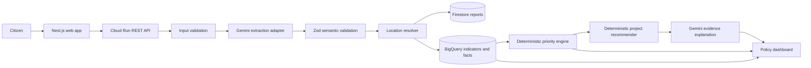
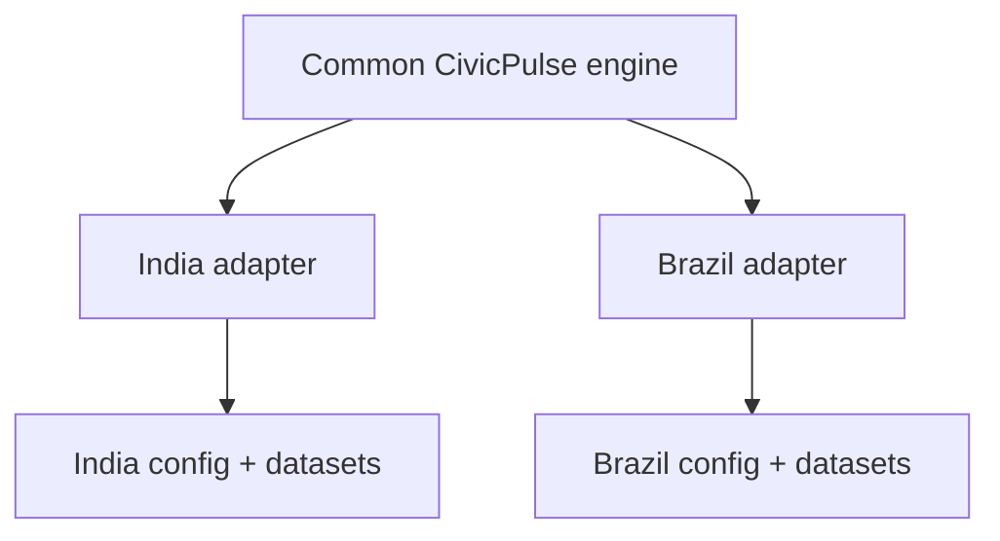

# CivicPulse — Architecture

Status: Phase 0 design; implementation not started.

## 1. Architectural goal

CivicPulse is a decision-support system. Gemini understands unstructured multilingual citizen input and explains verified evidence. Application code and public/realistic data determine location, enrichment, priority, and recommended project type.



## 2. Runtime boundaries

### Web application

The Next.js application provides:

- citizen text input and confirmation
- language and region selection
- policymaker filters, map, ranked list, evidence panel, and source labels
- list/card fallback if the map is unavailable

The browser may use the restricted Maps browser key. It must never receive server credentials.

### Cloud Run API

The API is stateless. It owns:

- request validation
- orchestration of AI, location, persistence, and analytics adapters
- authorization checks when authentication is added
- stable API response contracts
- retries and controlled failure states

### AI adapter

The AI adapter is the only module that knows the Google Gen AI SDK. It exposes application-level methods such as:

```ts
extractCivicRequest(input: ExtractionInput): Promise<ExtractionResult>;
explainRecommendation(input: ExplanationInput): Promise<ExplanationResult>;
```

The model name is read from `GEMINI_MODEL`.

### Firestore

Firestore stores operational documents and report lifecycle state. It is not the source of truth for analytical scoring.

### BigQuery

BigQuery stores indicator facts, source lineage, analytical facts, and region-level results. Queries must be bounded by country, date, region, and category filters where applicable.

## 3. Processing flow

1. Client sends text, optional coordinates, selected country, language, and channel.
2. API validates the request and assigns a stable report ID.
3. Voice, when added, is converted to text before this same flow.
4. Gemini returns the constrained civic extraction object.
5. Zod validates enum values, numeric bounds, required fields, and nullable location.
6. The location resolver uses explicit coordinates, user-selected region, or server-side geocoding in that order.
7. The report is stored with AI/model/processing metadata.
8. Analytics joins the report to region indicators and source-labeled data.
9. The priority engine calculates a normalized 0–100 score in code/SQL.
10. The recommender chooses a project type using deterministic mappings.
11. Gemini summarizes only the supplied evidence.
12. The dashboard renders the ranked result and its evidence chain.

## 4. Country portability

Country-specific data and rules are injected through `CountryConfig` and `CountryAdapter`.



Core modules must refer to country-neutral concepts such as `Region`, `PopulationIndicator`, and `InfrastructureIndicator`. India-specific names, assumptions, and field mappings belong in the adapter/config layer.

## 5. Failure containment

| Failure | API behavior | UI behavior |
|---|---|---|
| Gemini timeout/invalid output | Retry once, then `needs_review` | Explain that processing needs review |
| Missing location | Preserve null and request selection | Show region picker |
| Geocoder failure | Store unresolved status | Use region selection or list view |
| Firestore failure | Return controlled error and log correlation ID | Retry action; no fabricated success |
| BigQuery failure | Use cached/demo analytical snapshot | Show data freshness/fallback label |
| Maps failure | Return dashboard data independently | Render ranked cards/table |
| Explanation failure | Keep deterministic recommendation and evidence | Show evidence without AI prose |

## 6. Security and privacy

- Use Cloud Run service-account identity and Application Default Credentials.
- Keep server keys in Secret Manager or managed secret bindings.
- Restrict the Maps browser key to allowed origins and APIs.
- Do not store names, phone numbers, or email unless a later requirement justifies them.
- Display administrative-level locations in the policymaker dashboard rather than exact household coordinates.
- Keep synthetic/demo records explicitly labeled.
- Add request size limits, rate limits, abuse classification, and structured logs before public exposure.

## 7. Deployment shape

```text
Next.js web deployment
        │
        ▼
Cloud Run API revision
        ├── Vertex AI / Gemini
        ├── Firestore
        ├── BigQuery
        ├── Geocoding API
        └── Secret Manager
```

The first deployment can use one API service and one web application. Split services only when an operational need is demonstrated.

## 8. Observability

Every report should carry:

- `report_id`
- request correlation ID
- processing version
- model name/version
- status transition
- source type
- timestamps

Logs must exclude raw personal data wherever possible. Metrics should cover request latency, Gemini failures, validation failures, unresolved locations, and dashboard query errors.
